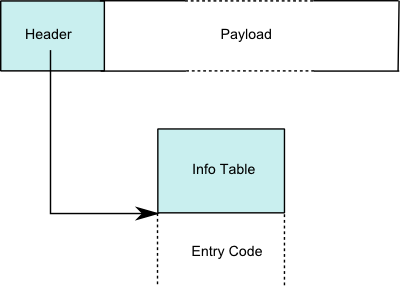

% An introduction to GHC's Haskell execution model
% Simon Meier, Erudify AG
% HaskellerZ meetup - March 21st, 2013

Goal of this talk
=================

Simplify the understanding of the runtime behaviour of Haskell programs
compiled with GHC. For example,

  - What are the memory requirements of values of the following two types?

    ~~~ {.haskell}
    data List a = Nil | One a (List a)

    data ListInt = NilI | OneI {-# UNPACK #-} !Int ListInt
    ~~~

  - Why is the following function prone to a stack-overflow?
  
    ~~~~ {.haskell}
    sumN :: Int -> Int
    sumN 0 = 0
    sumN n = n + sumN (n - 1)
    ~~~~

Essentially, this talk provides an introduction to
[GHC's RTS
commentary](http://hackage.haskell.org/trac/ghc/wiki/Commentary/Rts),
which guides through [GHC's RTS sources](https://github.com/ghc/ghc/tree/master/rts).

Memory layout of (heap) objects
===============================

GHC uses the same basic layout for *every* object in the RTS. 

Basic closure layout                          Basic info table layout
--------------------------------------------  ----------------------------------------------
  
--------------------------------------------  ----------------------------------------------

Structure of a header.

~~~~ {.c}
typedef struct {
    const struct _StgInfoTable* info;
#ifdef PROFILING
    StgProfHeader         prof;
#endif
#ifdef GRAN
    StgGranHeader         gran;
#endif
} StgHeader;
~~~~

For more information, see the [GHC
commentary](http://hackage.haskell.org/trac/ghc/wiki/Commentary/Rts/Storage/HeapObjects).

Example: a list of Int's
===========================

~~~~ {.haskell}
data List a = Nil | One a (List a)

ex1 :: List Int
ex1 = One 1 (One 2 (One 3 Nil))
~~~~

TODO: Image

Example: a list of unboxed Int's
================================

~~~~ {.haskell}
data ListInt = NilI | OneI {-# UNPACK #-} !Int ListInt

ex1 :: ListInt
ex1 = OneI 1 (OneI 2 (OneI 3 NilI))
~~~~

TODO: Image

Normal forms
============

normal form (NF)

:   An expression in normal form is fully evaluated, and no sub-expression
    could be evaluated any further (i.e. it contains no un-evaluated thunks).

weak head normal form (WHNF)

:   An expression in weak head normal form has been evaluated to the outermost
    data constructor or lambda abstraction (the head).

~~~~{.haskell}
-- in NF
42
(2, "hello")
\x -> (x + 1)

-- not in NF
1 + 2                 -- we could evaluate this to 3
(\x -> x + 1) 2       -- we could apply the function
"he" ++ "llo"         -- we could apply the (++)
(1 + 1, 2 + 2)        -- we could evaluate 1 + 1 and 2 + 2

-- in WHNF 
(1 + 1, 2 + 2)       -- the outermost part is the data constructor (,)
\x -> 2 + 2          -- the outermost part is a lambda abstraction
'h' : ("e" ++ "llo") -- the outermost part is the data constructor (:)

-- not in WHNF
1 + 2                -- the outermost part here is an application of (+)
(\x -> x + 1) 2      -- the outermost part is an application of (\x -> x + 1)
"he" ++ "llo"        -- the outermost part is an application of (++)
~~~~

For more information, see this [StackOverflow
question](http://stackoverflow.com/questions/6872898/haskell-what-is-weak-head-normal-form).

Haskell evaluation
==================

**Case distinctions are the fuel of the execution of Haskell code.**

A case distinction

~~~~{.haskell}
case x of _ -> e
~~~~

forces the evaluation of the value denoted by the variable `x` to WHNF
when the expression `e` is evaluated to WHNF.

Ultimately, Haskell programs are run by forcing the value of 
`(runIO main) theWorld#`{.haskell} 
to WHNF, where

~~~~{.haskell}

newtype IO a = IO { runIO :: World# -> (# a, World# #) }

theWorld# :: World#    -- magical reference to the world

~~~~

For more information on the implementation of the `IO` monad, see
[`GHC.Types`](http://www.haskell.org/ghc/docs/7.6.2/html/libraries/ghc-prim-0.3.0.0/GHC-Types.html#t:IO).

Example: summing a list of Int's (I)
====================================

~~~~ {.haskell}
sumList :: List Int -> Int
sumList Nil        = 0
sumList (One x xs) = x + sumList xs

test :: Int
test = sumList (One 1 (One 2 (One 3 Nil)))
~~~~~

High-level outline of evaluating `test` to WHNF:

~~~~ {.haskell}
   test
~> sumList (One 1 (One 2 (One 3 Nil)))
~> 1 + sumList (One 2 (One 3 Nil))
~> 1 + (2 + sumList (One 3 Nil))
~> 1 + (2 + (3 + (sumList Nil)))
~> 1 + (2 + (3 + 0))
~> 1 + (2 + 3)
~> 1 + 5
~> 6
~~~~

Example: summing a list of Int's (II)
=====================================

~~~~ {.haskell}
sumList :: List Int -> Int
sumList xs = case xs of
               Nil      -> 0
               One x xs -> x + sumList xs

test :: Int
test = sumList ex1

ex1 = One 1 ex1_1
ex1_1 = One 2 ex1_2
ex1_2 = One 3 ex1_3
ex1_3 = Nil
~~~~

Evaluating `test` to WHNF with explicit stack management.

~~~~ {.haskell}
   test                                    <| []                  -- tail call
~> sumList ex_1                            <| []                  -- tail call
~> case ex1 of Nil      -> 0
               One x xs -> x + sumList xs  <| []                  -- push return-closure onto stack
~> ex1                                     <| [case ?? of ...]    -- tail call
~> One 1 ex1_1                             <| [case ?? of ...]    -- WHNF reached: return control to caller, i.e.,
                                                                  --   jump to the top-most stack frame
~> case One 1 ex1_1 of ...                 <| []                  -- select appropriate case
~> (+) 1 (sumList ex1_1)                   <| []                  -- force 'sumList ex1_1' to WHNF 
                                                                  --   => push return-closure onto stack
~> sumList ex1_1                           <| [(+) 1 ??]          -- tail call
~> case ex1_1 of ...                       <| [(+) 1 ??]          -- push return-closure onto stack
~> ex1_1                                   <| [case ?? of ..., (+) 1 ??]  -- ...
~> One 2 ex1_2                             <| [case ?? of ..., (+) 1 ??]  -- ...
~> case One 2 ex1_2 of ...                 <| [(+) 1 ??]
~> (+) 2 (sumList ex1_2)                   <| [(+) 1 ??]
~> sumList ex1_2                           <| [(+) 2 ??, (+) 1 ??]
~> .... ~>
~> 0                                       <| [(+) 3 ??, (+) 2 ??, (+) 1 ??]
~> (+) 0 3                                 <| [(+) 2 ??, (+) 1 ??]
~> 3                                       <| [(+) 2 ??, (+) 1 ??]
~> (+) 2 3                                 <| [(+) 1 ??]
~> 5                                       <| [(+) 1 ??]
~> (+) 1 5                                 <| []
~> 6                                       <| []
~~~~

Evaluation costs
================

When executing a Haskell program, time is spent on

- constructing new objects on the stack or the heap
- executing primitive operations
- performing case distinctions
- calling functions

The [Spineless Tagless G-machine (STG
machine)](http://research.microsoft.com/pubs/67083/spineless-tagless-gmachine.ps.gz)
makes these costs explicit.

Overview: GHC's compilation pipeline
====================================

For more information, see 
[this](http://hackage.haskell.org/trac/ghc/wiki/Commentary/Compiler/HscPipe)
and
[that](http://hackage.haskell.org/trac/ghc/wiki/Commentary/Compiler/HscMain).

Invariants established by CorePrep
==================================

- expression are in in *A-normal form* (ANF), i.e.,
  the argument of every application is a variable or literal
- constructors and primitive operations only occur fully saturated
- no nested patterns in case distinctions
- and a few [more
  invariants](https://github.com/ghc/ghc/blob/master/compiler/coreSyn/CorePrep.lhs)

~~~~{.haskell}
-- not in ANF --
----------------
\x -> f (g x) [x]    -- use of compound arguments 'g x' and '[x]'

\x -> (x:)           -- unsaturated use of ':' constructor

case x of            -- nested pattern in case distinction
  [y] -> e1
   _  -> e_def

-- in ANF --
------------
\x -> let y = g x 
          z = [x]
      in f y z

\x y -> x:y

let zz = e_def
in case x of
      []     -> zz
      x1:xs1 -> case xs1 of
                  [] -> e1
                  _  -> zz
~~~~

Example: core-prep of `sumList`
===============================

~~~~ {.haskell}
data List a = Nil | One a (List a)

sumList :: List Int -> Int
sumList Nil        = 0
sumList (One x xs) = x + sumList xs

ex1 :: List Int
ex1 = One 1 (One 2 (One 3 Nil))

test = sumList ex1
~~~~

Compiled with [`ghc -O2 -dsuppress-all -ddump-prep
List.hs`](http://www.haskell.org/ghc/docs/7.6.2/html/users_guide/options-debugging.html)
yields

~~~~ {.haskell}
==================== CorePrep ====================
ex6 = I# 1
ex5 = I# 2
ex4 = I# 3
ex3 = One ex4 (Nil)
ex2 = One ex5 ex3
ex1 = One ex6 ex2

Rec {
$wsumList =
  \ w_sca ->
    case w_sca of _ {
      Nil -> 0;
      One x_sce xs_sch ->
        case x_sce of _ { I# x1_scj ->
        case $wsumList xs_sch of ww_sck { __DEFAULT -> +# x1_scj ww_sck }
        }
    }
end Rec }

sumList =
  \ w_scm ->
    case $wsumList w_scm of ww_sco { __DEFAULT -> I# ww_sco }

test = case $wsumList ex1 of ww_scq { __DEFAULT -> I# ww_scq }

Nil = Nil
One = \ @ a_aaf eta_B2 eta_B1 -> One eta_B2 eta_B1
~~~~

Example: map over a list of Int's
=================================

~~~~ {.haskell}
mapList :: (a -> b) -> List a -> List b
mapList f Nil        = Nil
mapList f (One x xs) = One (f x) (mapList f xs)

foo :: Int -> Int
foo x = x + 0xDeadBeef

test :: List Int
test = mapList foo (One 1 (One 2 (One 3 Nil)))
~~~~

Compiled with [`ghc -O2 -dsuppress-all -ddump-prep
List.hs`](http://www.haskell.org/ghc/docs/7.6.2/html/users_guide/options-debugging.html)
yields

~~~~ {.haskell}
==================== CorePrep ====================
Rec {
mapList =
  \ @ a_abc @ b_abd f_sct ds_sco ->
    case ds_sco of _ {
      Nil -> Nil;
      One x_scs xs_scv ->
        let {
          sat_scE = mapList f_sct xs_scv } in
        let {
          sat_scF = f_sct x_scs } in
        One sat_scF sat_scE
    }
end Rec }

foo =
  \ x_scy ->
    case x_scy of _ { I# x1_scB ->
    case +# x1_scB 3735928559 of sat_scG { __DEFAULT -> I# sat_scG }
    }

test6 = I# 1
test5 = I# 2
test4 = I# 3
test3 = One test4 (Nil)
test2 = One test5 test3
test1 = One test6 test2
test = mapList foo test1

Nil = Nil
One = \ @ a_aab eta_B2 eta_B1 -> One eta_B2 eta_B1
~~~~

Exploiting our newly gained knowledge (I)
=========================================

What implementation is faster?

~~~~{.haskell}
sumN :: Int -> Int
sumN 0 = 0
sumN n = n + sumN (n - 1)

sumNAcc :: Int -> Int
sumNAcc =
    go 0
  where
    go acc 0 = acc
    go acc n = go (n + acc) (n -1)
~~~~

Exploiting our newly gained knowledge (II)
==========================================

*It's time for some interactive experimentation; i.e., let's have some fun
with*

[`ghc -O2 -dsuppress-all -ddump-prep`](http://www.haskell.org/ghc/docs/7.6.2/html/users_guide/options-debugging.html)

and all the [other debugging flags](http://www.haskell.org/ghc/docs/7.6.2/html/users_guide/options-debugging.html)
provided by GHC.

Note that some of the examples are included in the sources of this talk at
[Github](https://github.com/meiersi/HaskellerZ/tree/master/meetups/20130321-Intro_GHC_RTS).

The end...
==========

**..and further references for the curious:**

 - [sources](https://github.com/meiersi/HaskellerZ/tree/master/meetups/20130321-Intro_GHC_RTS)
   for this talk
 - [Videos](http://hackage.haskell.org/trac/ghc/wiki/AboutVideos) about GHC's architecture
 - Papers leading up to GHC's current execution model:
     - [Implementing lazy functional languages on stock hardware: the
       Spineless Tagless
       G-machine](http://research.microsoft.com/~simonpj/papers/spineless-tagless-gmachine.ps.gz),
       SL Peyton Jones, Journal of Functional Programming 2(2), Apr 1992,
       pp127-202.
     - [How to make a fast curry: push/enter vs eval/apply, Simon Marlow and
       Simon Peyton Jones, Proc International Conference on Functional
       Programming, Snowbird, Sept 2004,
       pp4-15.](http://research.microsoft.com/en-us/um/people/simonpj/papers/eval-apply/index.htm) 
     - [Faster laziness using dynamic pointer
       tagging](http://research.microsoft.com/en-us/um/people/simonpj/papers/ptr-tag/index.htm),
       Simon Marlow, Alexey Rodriguez Yakushev, and Simon Peyton Jones, ICFP 2007. 
 - [GHC sources](https://github.com/ghc/ghc):
   I suggest to download the [most recent source
   distribution](http://www.haskell.org/ghc/download_ghc_7_6_1#sources) and
   browse it using our favourite text editor
 - Stanford Haskell lecture: [handout about memory
   layout](http://www.scs.stanford.edu/11au-cs240h/notes/memory.html) and
   the [lecture overview](http://www.scs.stanford.edu/11au-cs240h/)

Unfinished appendix: memory layout during execution (I)
=======================================================

~~~~ {.haskell}
mapList f Nil        = Nil
mapList f (One x xs) = One (f x) (mapList f xs)

foo :: Int -> Int
foo x = x + 0xDeadBeef
~~~~

Memory layout *before* reducing `mapList foo (One 1 (One 2 Nil))` to WHNF.

TODO: Image

Unfinished appendix: memory layout during execution (II)
========================================================

~~~~ {.haskell}
mapList f Nil        = Nil
mapList f (One x xs) = One (f x) (mapList f xs)

foo :: Int -> Int
foo x = x + 0xDeadBeef
~~~~

Memory layout *after* reducing `mapList foo (One 1 (One 2 Nil))` to WHNF.

TODO: Image

Unfinished appendix: common closure types
=========================================

  - Constructors: `CONSTR`, `CONSTR_p_n`, `CONSTR_STATIC`, ...
  - Functions: `FUN`, `FUN_p_n`, `FUN_STATIC`, ...
  - Thunks: `THUNK`, `THUNK_p_n`, `THUNK_SELECTOR`, ...
  - (Partial) applications: `PAP`, `AP`
  - Indirections: `IND`, `IND_OLD_GEN`, ...
  - MVars, Black holes, Byte-code objects, Thread State Objects, ...

For more information, see the
[GHC
commentary](http://hackage.haskell.org/trac/ghc/wiki/Commentary/Rts/Storage/HeapObjects#Typesofobject).

