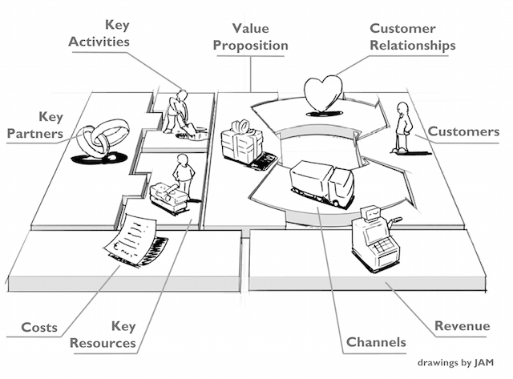

% Haskell and FP in Industry
% Dr. Simon Meier, Digital Asset
% December 1st, 2016

About me
========

- learned to programming Basic (1995)
- learned about Haskell during my ETH CS studies (2003)
- first "commercial" Haskell development during PhD (2007 - 2012)
- Haskell software engineer/architect at Better AG (2013 - 2014)
- post-doctoral researcher at IBM Research (2014 - 2015)
- Haskell software engineer/architect at Elevence Digital Finance AG (2015 - 2016)
- Haskell and formal methods expert at Digital Asset (2016 -)

Goals of this talk
==================

- explain why I use Haskell and formal methods in my professional career
- convey some of the lessons I learned
- provide pointers for further learning

Commercial Haskell development - my view on it
==============================================

We'll want to be conscious about our business model.

See [this post-mortem of Klimpr](https://medium.com/@adriankyburz/it-s-been-an-amazing-ride-now-my-startup-is-dead-and-here-s-what-i-ve-learned-284e14ef4ee0#.w4621izgf),
a friend's startup, for further insights.

We are always selling a user experience
==============================================

Haskell is just a tool in our box.

We're only done once we've shipped our code
==============================================

Deployment and coding are equally important.

We want to use the right tools for the jobs at hand
==============================================

Haskell is a great tool for many software engineering tasks.

However not all problems are best solved using Haskell or FP.

Writing code in an agile world
==============================================

Our guidelines at Digital Asset:

- We acknowledge that all code is going to be changed in the future.
- We simplify reasoning about changes and enlist the computer where possible
  to guide us through changes.
- When in doubt we optimize for readability and ease of reasoning about code.

Some tools for reasoning about code
===================================

- type systems
- purity
- totality
- theorem proving

How Haskell supports reasoning about code
=========================================

- type system that guarantees purity
- pattern-matching greatly simplifies totality proofs
- theorem proving: in the works
    - [Refinement Types](https://github.com/ucsd-progsys/liquidhaskell)
    - [Dependent Haskell](https://github.com/goldfirere/thesis/blob/master/built/thesis.pdf)
    - [HipSpec](https://github.com/danr/hipspec)
    - [Haskabelle](https://isabelle.in.tum.de/haskabelle.html)

Reasoning about code in general
===============================

Some pointers:

  - [Isabelle/HOL](https://isabelle.in.tum.de/):
    interactive theorem prover based on higher-order logic
  - [Coq](https://coq.inria.fr/):
    interactive theorem prover based on dependent types;
    used for example in this [Book on formally verified PLs](https://www.cis.upenn.edu/~bcpierce/sf/current/toc.html)
  - [Satisfiability module Theories (SMT)](https://en.wikipedia.org/wiki/Satisfiability_modulo_theories):
    one of the great examples of automated theorem proving [Z3](https://github.com/Z3Prover/z3)
  - [Lean](http://leanprover.github.io/): combine interactive and automated theorem proving
  - [CompCert](http://compcert.inria.fr/): a verified C compiler
  - [CakeML](https://cakeml.org/): a verified ML compiler
  - [SeL4 Verified Microkernel](https://sel4.systems/)
  - [High-Assurance Cyber Military Systems](http://www.darpa.mil/program/high-assurance-cyber-military-systems)
  - [TLA+](http://research.microsoft.com/en-us/um/people/lamport/tla/tla.html) use at
    [Microsoft](https://www.microsoft.com/en-us/research/publication/ironfleet-proving-practical-distributed-systems-correct/) and
    [Amazon](http://research.microsoft.com/en-us/um/people/lamport/tla/amazon.html)

Industrial Haskell programming
==============================

*know thy version control*

  - [monorepo](http://danluu.com/monorepo/)
  - carefully tailor [repo layout](https://github.com/meiersi/HaskellerZ/tree/master/meetups/20160128-A_primer_to_commercial_Haskell_programming/code-by-elevence) to your needs

Industrial Haskell programming
==============================

*know thy tooling*

  - [`stack`](https://docs.haskellstack.org/en/stable/README/)
  - [`ghc`](https://downloads.haskell.org/~ghc/latest/docs/html/users_guide/)
  - [`ghcid`](https://github.com/ndmitchell/ghcid)

Industrial Haskell programming
==============================

*know thy [Hackage](https://hackage.haskell.org/) libraries*

- libraries to know by heart:
  [base](https://hackage.haskell.org/package/base),
  [safe](https://hackage.haskell.org/package/safe),
  [bytestring](https://hackage.haskell.org/package/bytestring),
  [text](https://hackage.haskell.org/package/text),
  [containers](https://hackage.haskell.org/package/containers),
  [unordered-containers](https://hackage.haskell.org/package/unordered-containers),
  [transformers](https://hackage.haskell.org/package/transformers),
  [either](https://hackage.haskell.org/package/either),
  [mtl](https://hackage.haskell.org/package/mtl),
- some libraries to know about:
  [lens](https://hackage.haskell.org/package/lens),
  [aeson](https://hackage.haskell.org/package/aeson),
  [attoparsec](https://hackage.haskell.org/package/attoparsec),
  [megaparsec](https://hackage.haskell.org/package/megaparsec),
  [warp](https://hackage.haskell.org/package/warp),
  [blaze-html](https://hackage.haskell.org/package/blaze-html),
  [conduit](https://hackage.haskell.org/package/conduit),
  [optparse-applicative](https://hackage.haskell.org/package/optparse-applicative)

Industrial Haskell programming
==============================

*know thy blogs and books*

- [haskell.org](https://www.haskell.org/)
- [What I wish I knew when learning Haskell](http://dev.stephendiehl.com/hask/)
- [Typeclassopedia](https://wiki.haskell.org/Typeclassopedia)
- [Parallel and Concurrent Programming in Haskell](http://chimera.labs.oreilly.com/books/1230000000929/index.html)

more beginner oriented books

- [Programming in Haskell](http://www.cs.nott.ac.uk/~pszgmh/pih.html)
- [Haskell Programming from first principles](http://haskellbook.com/)

slightly outdated

- [Real World Haskell](http://book.realworldhaskell.org/)

Industrial Haskell programming
==============================

*know thy patterns*

some helpful talks

- [Simon Meier - A primer to commercial Haskell programming](https://github.com/meiersi/HaskellerZ/blob/master/meetups/20160128-A_primer_to_commercial_Haskell_programming/slides/commercial_haskell_primer.md)
  ([video](https://www.youtube.com/watch?v=ywOvfjpbYR4))
- [Jasper Van der Jeugt - Haskell: Mistakes I made](https://github.com/meiersi/HaskellerZ/blob/master/meetups/20160331-Haskell_Mistakes/slides.pdf)
  ([video](https://www.youtube.com/watch?v=S3WGPuqfBLg))

The Haskell community
=====================

**:-) never give up on reasoning about your code :-)**

- [HaskellerZ](https://github.com/meiersi/HaskellerZ),
  [Boston Haskell](https://www.meetup.com/Boston-Haskell/),
  [FP Syd](http://fp-syd.ouroborus.net/)
- [ZuriHac](https://wiki.haskell.org/ZuriHac2016),
  [MuniHac](http://munihac.de/),
  [BayHac](http://bayhac.org/),
  [HacPhi](https://wiki.haskell.org/Hac_%CF%86)
- [reddit](https://www.reddit.com/r/haskell/)
- [IRC](https://www.haskell.org/irc)

Questions ?
===========

Farhad: Why did you choose Haskell for your professional work?
======================================================

- I want to build software that works
- never loose ability to reason about code
- pure and total functions are key
- Haskell is currently the only industrial language that supports this style

Farhad: Looking back, what issues made you glad that you took this decision, and what issues made you regret taking this decision?
==========================================================================================================================

- Haskell programming plus interactive theorem proving are great guides
  to understand the core of software engineering
- people that care about principled approaches are drawn to Haskell, the
  problems that you can tackle are very interesting
- I don't regret this decision. It brought me to the place I am and I think
  it provides a great step towards software that works in all forms

Farhad: If FP is so great, why isn't everyone using it? What advances, do you feel, would work towards the industry better reaping the benefits of FP?  (e.g. training, better tools, etc.)
==========================================================================

- It is a very different approach. Purity is so easily lost. The common argument
  of JVM-based languages that they have all the libraries. However most of
  these libraries are stateful and compose badly.
- education in formal methods and theorem proving; i.e., how to write
  correct code
- easy means to combine correctness and performance; Rust is a great example
- for Haskell: a great IDE

Farhad: Do you think FP will become more mainstream in the future?
==========================================================

- yes I definitely think so; Spark, React.js, Java 8, C++14, all point in
  this direction

